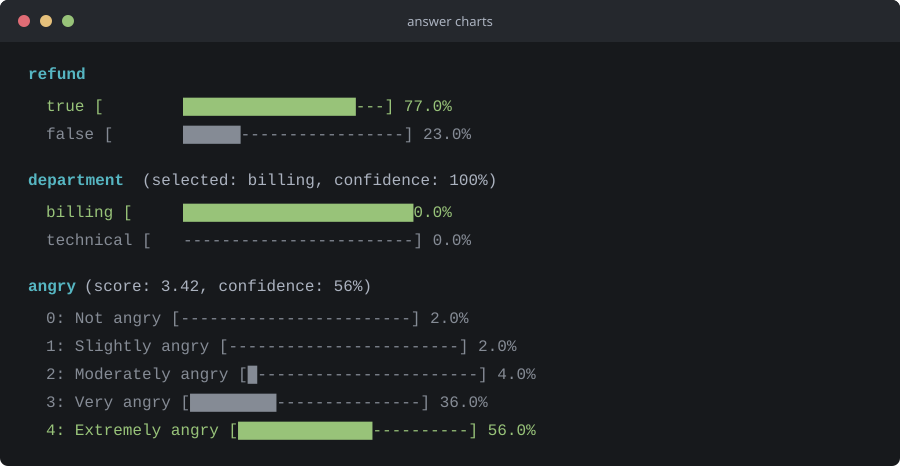

# TypeScript Jev Example

Minimal TypeScript example for sending a request to the `jev-latest` model through OpenRouter and displaying its answers as console charts.

## Requirements

- Node.js 20 or newer
- An OpenRouter API key with access to `jev-latest`

## Run

After checking out the repository, run these commands from its root:

```sh
npm ci
```

Set `OPENROUTER_API_KEY` in the same terminal session. For PowerShell:

```powershell
$env:OPENROUTER_API_KEY = "your-api-key"
```

For Command Prompt:

```cmd
set OPENROUTER_API_KEY=your-api-key
```

Start the example:

```sh
npm start
```

To compile the TypeScript source, run `npm run build`.

## Example Output

Representative chart output for yes/no, choice, and score answers. Values are illustrative.

