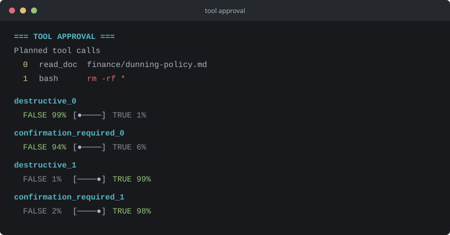
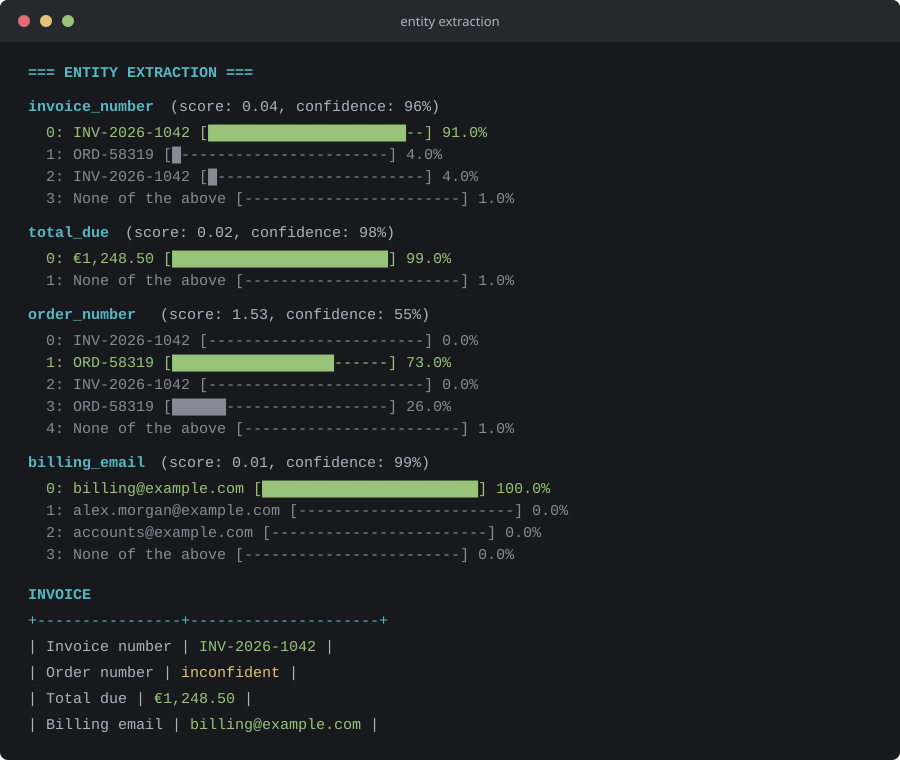

# TypeScript Jev Example

Minimal TypeScript example for sending a request to the `jev-latest` model through OpenRouter and displaying its answers as console charts.

## Requirements

- Node.js 20 or newer
- An OpenRouter API key with access to `jev-latest`

## Run

After checking out the repository, run these commands from its root:

```sh
npm ci
```

Set `OPENROUTER_API_KEY` in the same terminal session. For PowerShell:

```powershell
$env:OPENROUTER_API_KEY = "your-api-key"
```

For Command Prompt:

```cmd
set OPENROUTER_API_KEY=your-api-key
```

Start the example:

```sh
npm start
```

To compile the TypeScript source, run `npm run build`.

## Examples

The project includes a few small decision-model examples:

- `src/examples/email_triage`: classify a support email and recommend how to handle it.
- `src/examples/steps_security_validation`: assess tool calls for destructive actions and confirmation needs.
- `src/examples/entity_extraction`: extract invoice details and flag low-confidence fields.

The app entry point in `src/app.ts` runs all three examples in sequence when you start the project.

## Example Output

The screenshots below are synthetic terminal output for each example.

### Email Triage

Classifies a support email and recommends how to handle it.


### Tool Approval

Assesses tool calls for destructive actions and confirmation needs.



### Entity Extraction

Extracts invoice details and flags low-confidence fields.

